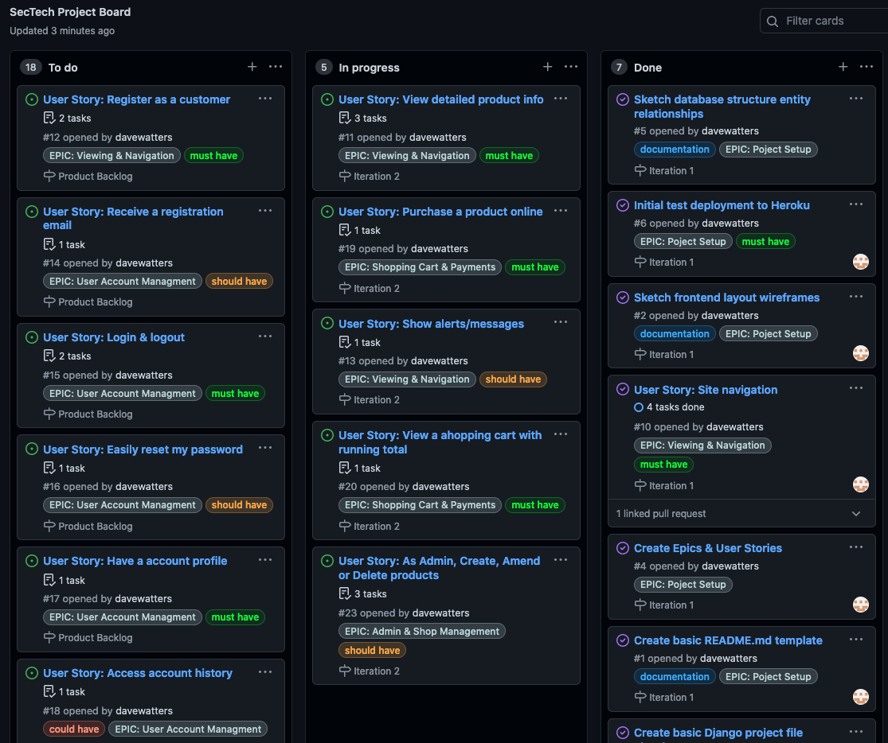
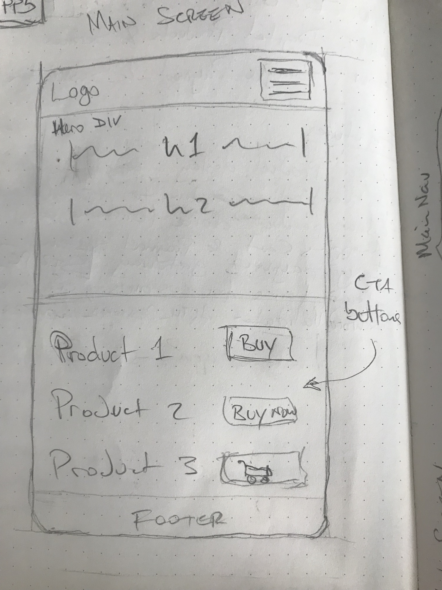
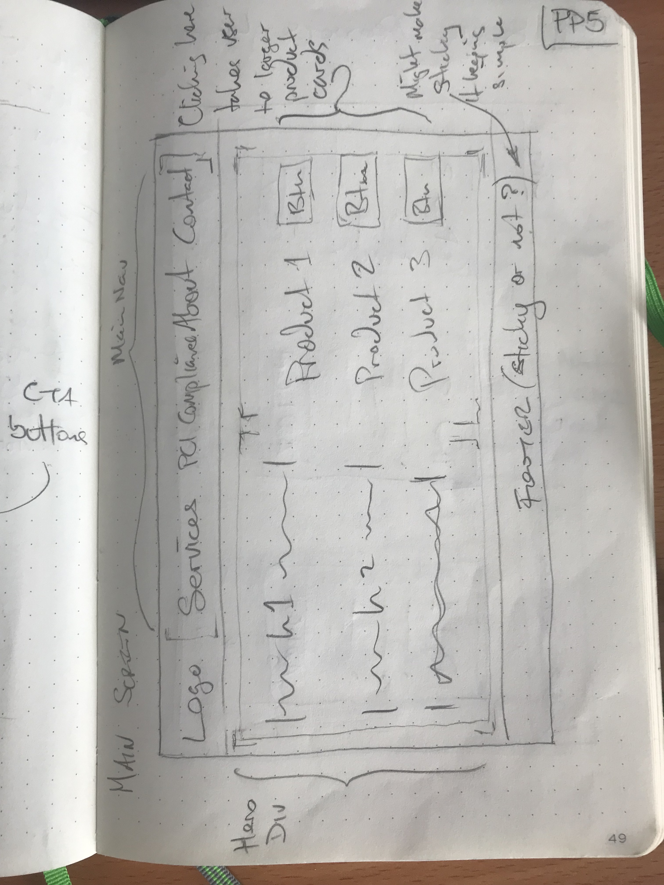
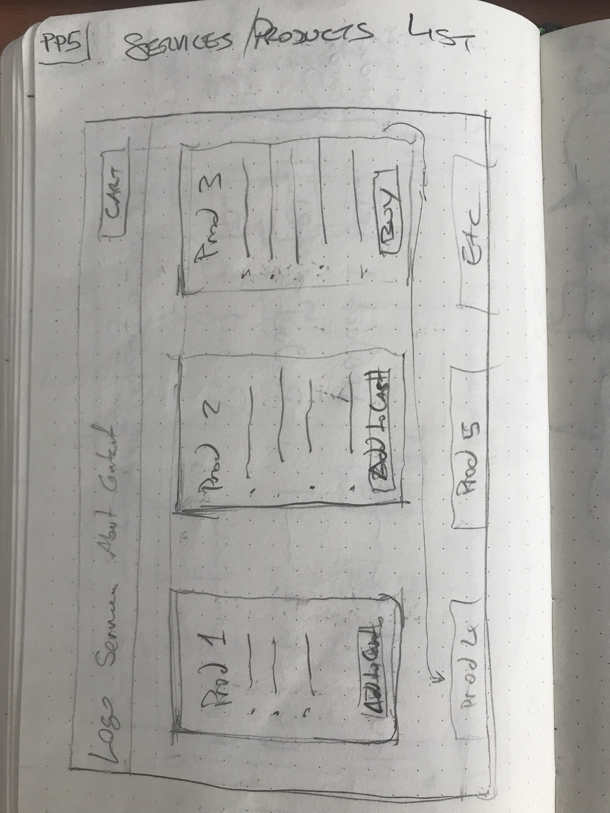
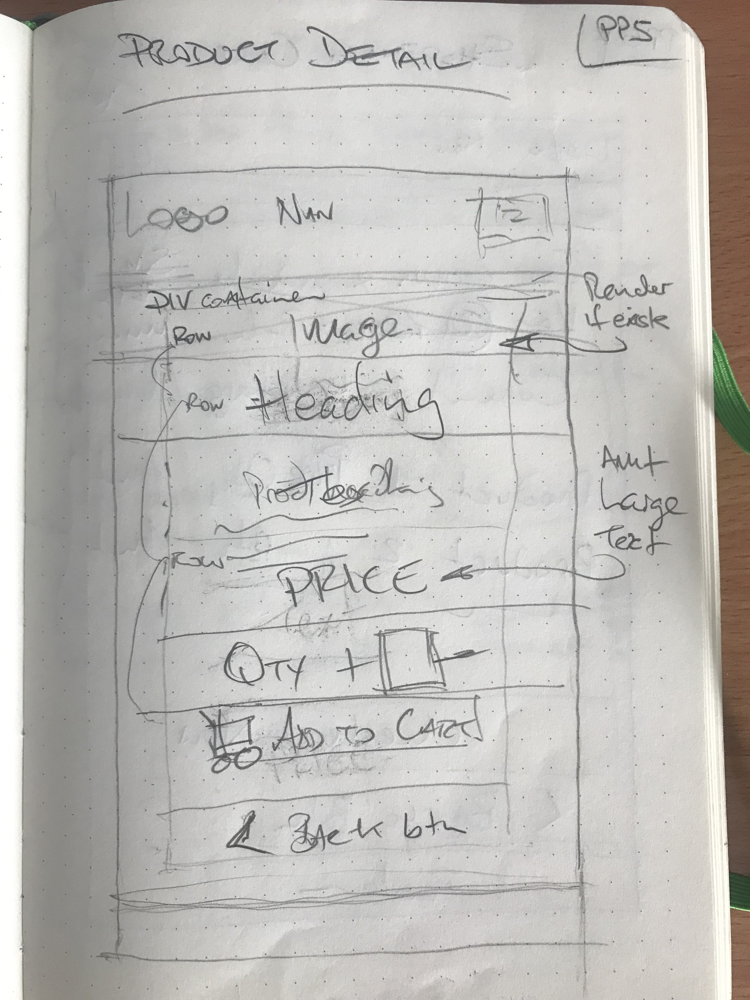
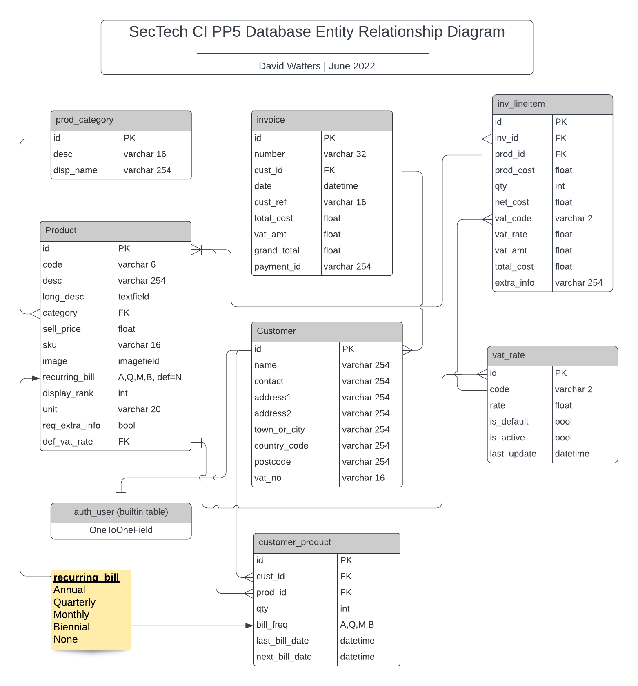
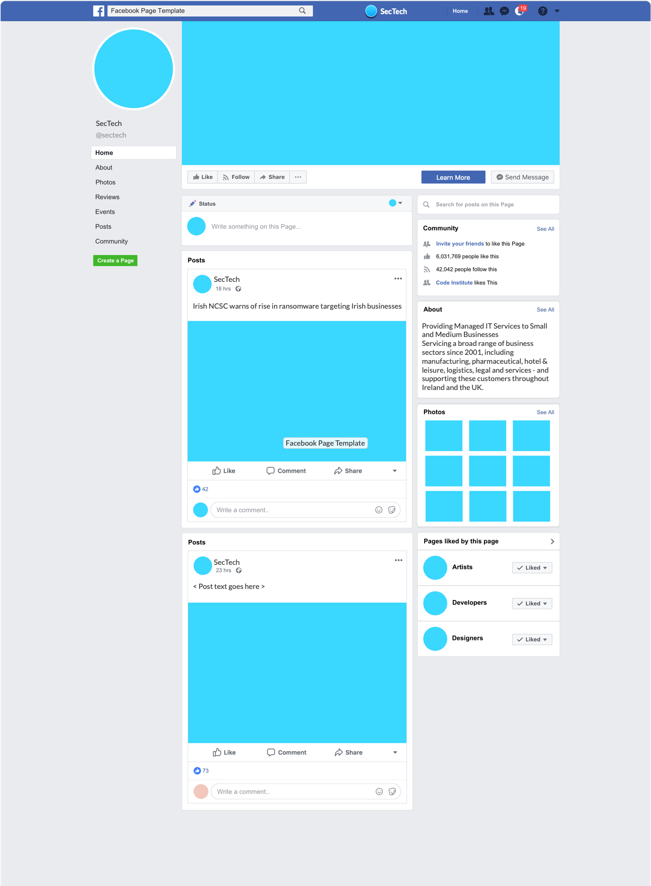

# SecTech - IT Software & Services eCommerce Site

## Affordable Cyber Secuirty for Small Business

<br />

You can view the live deployed app [HERE.](https://sectech-ci-pp5.onrender.com/)
<br />

<!-- Responsive desgin sample image from http://ami.responsivedesign.is/ -->
<!-- <h2 align="center"></h2> -->

## - Table of Contents -
* [Purpose](#purpose)
* [User Experience Design (UX)](#user-experience-design)
* [Features](#features)
* [Technologies](#technologies)
* [Testing](#testing)
* [Deployment](#deployment)
* [SEO and Marketing](#seo-and-marketing)
* [Credits](#credits)

## - Purpose -
[This app was created as the fifth Portfolio Project (PP5) for the Code Institute's Full Stack Web Development course. The app is to showcase skills to design an eCommerce web application using an MVC framework and related contemporary technologies.  As a requirement the app is deployed to Heroku and payments are processed by Stripe. The site was later migrated to Render.com & ElephantSQL.com for free hosting.]    

A mock site for an IT Services company plannning to streamline their recurring revenue from Software-as-a-Service (SaaS) products using an online eCommerce site. The company plans to take payment up front for certain services - particularly SaaS cyber security products which are sold as a recurring annual licence. Monthly Managed IT Service contracts, daily Consultancy Services and even Remote Technical Support by the hour, and all can be bought in advance.  This should streamline the business, reduce time spent each month on the invoice/payment collection cylce and bolster the company's cash flow.
The company's customers receive the benefit of easy access to a suite of industlry leading cyber security products which are essential to the smooth running of their business systems. The products are bundled as a managed service at a fixed monthly cost. They can buy addtional support or consultancy on an as needed basis - only paying for what they use.

## - User Experience Design -

### Design Strategy Goals
This eCommerce application is for a business-to-business (B2B) sales model, selling digital products & services as recurring billing subscriptions with some single payment products. The target customer is any small business needing software to fulfill cybersecurity and compliance requirements. Additionally, customers can buy support and consultancy services. The software products are delivered as electronic licence via email or download.   
  - Create an online shop to sell IT service & software products to registered customers
  - Shop must be abe to process payments at point of sale
  - Site must be intuitive to read & navigate on both desktop & mobile devices - using Mobile-First design
  - Site must allow company admins and customers to authenticate and interact with the content, e.g. view accounts, purchase services and software licences, etc.
  - Site must inform the customer about latest compliance standards (e.g. PCI-DSS) and business cyber insurance requirements
  - Site must allow users to sign up for the mailing list   
  - Site will ideally have a blog as a means to inform customers and to help raise the business' online presence.

### Design Scope to Deliver MVP
  - #### Site Owner Goals
      As a site admin...
      - I want to to be able to setup and manage a products list
      - I want to be able to setup and manage customer accounts
      - I want customers to be able to buy products
      - I want to be able to take payments
      - I want to be able to view sales information

  - #### First Time Visitor Goals
      As a first time user...
      - I want to be able to intuitively navigate the site
      - I want to easily find information about relevant products
      - I want to be able to register for a customer account
      - I want to be able to buy software service products
      - I want to be able to buy technical support hours
      - I want to be able to buy consultancy hours

  - #### Returning Visitor Goals
      As a returning visitor...
      - I want to be able to log into my registered account
      - I want to be able to easily see details of active software licences
      - I want to be able to easily see details of the previous purchases
      - I want to be able to quickly purchase additional support or consultancy hours

### Agile Development Process: Epics & User stories
- To deliver MVP the following features were implemented in work sprint iterations.  Prioritization of each item changed as certain iteration milestones were reached, at which time the item's priority for that stage was adjusted. The workflow was actively monitored and adjusted using GitHub's repo Issues & Milestones features,  the Projects board as a kanban board to provide an overview of progress.  Each Epic feature was broken down into smaller User Story work units.

- ### **Epic: Viewing & Navigation of Site**
| As A/An       | I want to be able to        |  So that I can   |
|---|---|---|
| Site visitor  | Easily navigate the site    | Learn about about the business
| Site visitor  | View detailed product info  | Learn about the products
| Site visitor  | Register as a customer      | Buy products and services 
| Site visitor  | See clear messages about my actions | So that I get confrimation for my actions
- ### **Epic: User Account Management**
| As A/An       | I want to be able to        |  So that I can   |
|---|---|---|
| Customer      | Easily register for an account  | Have a customer account
| Customer      | Receive a registration email    | Verify that my acccount registration was successful
| Customer      | Easily login/logout             | Access my account information
| Customer      | Easily reset my password | Recover access to my account
| Customer      | Have an account profile         | Manage my details & view purchased products
| Customer      | Signup for a newsletter         | Keep informed of the latest IT security info
| Customer      | Access full account history     | View all transaction history
- ### **Epic: Shopping Cart & Payment Processing**
| As A/An       | I want to be able to        |  So that I can   |
|---|---|---|
| Customer      | Purchase a product online       | Activate & use the product immediately
| Customer      | View shopping cart with total   | View selected products before confirming purchase 
| Customer      | Receive an order confirmation email    | Instantly have a recepit for my purchase
- ### **Epic: Site Administration**
| As A/An       | I want to be able to        |  So that I can   |
|---|---|---|
| Site Admin    | Easily login/logout             | Access my site control panel
| Site Admin    | Create, Amend or Delete products| Manage my product offering
| Site Admin    | Create, Amend or Delete customers| Manage my customer profiles
| Site Admin    | View sales information          | Analyse sales data for site
| Site Admin    | Integrate transactions to accounting system | Have realtime financial records
- ### **Epic: SEO & Marketing**
| As A/An       | I want to be able to        |  So that I can   |
|---|---|---|
| Site Admin    | Apply SEO settings             | Ensure my site is ranked optimally
| Site Admin    | Creat email subscription newsletter| Market my business better
| Site Admin    | Create a site blog             | Encourage more traffic to my site

Agile methodology was used to provide an iterative approach to the project's development. Image below shows an example of the kanban board setup as created using GitHub:
<!-- <h2 align="center"></h2> -->
<h2 align="center"></h2>

- ### Design
    -   #### Layout
        Logo and site navigation is visible along the top bar and a simple footer on the bottom of the viewport.  Content is displayed in Boostrap 'card' styled sections on the main page. 
         
    -   #### Content
        Content is generated based on the available products for sale in the database. The products are rendered as floating cards with brief description and a CTA button.  Once clicked, the vistor is shown detailed product information and given the option to add a qty of the product to the shopping cart. 

    -   #### User Input
        Data is input or updated using Bootstrap forms. All user interaction controls are either standard Bootstrap buttons or intuitive Fontawesome icons. 

    -   #### Typography
        The Google font 'Montserrat' was chosen for it's clean modern look and scalability.

    -   #### Colour Scheme
        - A deep blue colour was chosen for the Logo. Research showed that blues are the most commonly used in cyber security & IT space - which is not that suprising since the colour blue inspires loyalty, confidence, security & reliable authority.  The call-to-action buttons were given a brighter green colour to encourage engagement.
        `logo colour: #235594`,
        `cta colour: #15d19b`

    -   #### Imagery
        Minimal. Plain background. Product logo images only.  
           
    
    -   #### Wireframes
        I did not create wireframes with software like Balsamiq, but I have decided to include pictures of my pencil sketches of my layout design process.  These do not necessarily represent the final look of the site pages.
        <h2 align="center"></h2>
        <h2 align="center"></h2>
        <h2 align="center"></h2>
        <h2 align="center"></h2>
        <h2 align="center"></h2>

    -   #### Database Entity Relationship Diagram
        <h2 align="center"></h2>


## - Features -  
To fulfil the needs of the site's users, the following features were implemented:

- **Simple navigation menu** is always visible at the top of the screen. The current page is indicated by the highlighted menu item.  The Login/Logout item indicates to the visitor if they are currently logged in.
- **Cutomer Registration** link is always visible to make it easy for the customer to register
- **System Messages** notify the user upon login/logout  
- **Products** are displayed prominently in clickable cards with clearly visible 'Add to Cart' buttons
- **Detailed product info** is diplayed when products are selected 

## - Future Features -
- Add content with detail about each of the various products for sale
- Update the about page with links to professional business organisations
- Add a Blog app the the site
- Integrate posting payment receipts to the BigRedCould accounting package using their API
- App to manage recurring invoicing integrated with the BigRedCould accounting package API

<!--  -->
<!-- End Features -->
<!--  -->


## - Technologies Used -

### Languages Used

- [Python 3.7+](https://en.wikipedia.org/wiki/Python_(programming_language)) with the [Django 3.2](https://en.wikipedia.org/wiki/Django_(web_framework)) web framework
### Databases Used
- [SQLite3](https://en.wikipedia.org/wiki/SQLite) in development, [PostgreSQL](https://en.wikipedia.org/wiki/PostgreSQL) in production
- [JSON](https://en.wikipedia.org/wiki/JSON) format files used in development for fixtures data

### Frameworks, Libraries & Programs Used

1.  [Git](https://git-scm.com/) was used for version control and managed via the VSCode terminal to commit to Git and push to GitHub.
1.  [GitHub](https://github.com/) was used to store the project's code after being pushed from Git
1.  [Flake8](https://flake8.pycqa.org/en/latest/) linter extension for VScode 
1.  [LucidChart](https://lucidchart.com) was used to create the ERD
1.  [Bootstrap 4]() front-end CSS toolkit
1.  [Font Awesome 6]() font and icon toolkit
1.  [Heroku](https://www.heroku.com) was used to deploy the app initially
1.  [Render](https://render.com) was later used to host the app
1.  [ElephantSQL](https://elephantsql.com) was later used to host the PostgresSQL database


<!---  --->
<!---  Begin testing section --->
<!---  --->

## Testing

All testing and code validation is documented [in this linked TESTING.md document](readme-docs/TESTING.md) located in the repo `readme-docs` folder.

## Bugs  

1. **FIXED** [issue #40](https://github.com/davewatters/sectech-ci-pp5/issues/40) Observed payment amt going to Stripe sometimes wrong. When more than one item in cart at checkout, total amount & vat amount were wrong.
    - Fix: amend loop to build cart items, in cart_contents() context, so that cart_vat_amt is calculated correctly [ `shopping_cart/contexts.py` ]
1. **FIXED** [issue #36](https://github.com/davewatters/sectech-ci-pp5/issues/36) Clicking on a navbar link does not highlight the menu item [ `templates/includes/main_nav.html` ]. Original code worked only when nav bar code was in `base.html`, when it was implemented as an include, it broke.
    - Fix: Use Django template filter `` to get the url name, then apply `active` to the `<a>` tag class.
1. W3C Validator error in `checkout/checkout_success.html`:  Table column 2 established by element `th` has no cells beginning in it. Table definition and rendered page all look correct.
    - Fix: 
1. Wave accessibiilty error in footer on all pages: 1 x Missing form label: Error was introduced after embedding the Mailchimp plugin but I can't actually see it's corresponding icon on the page.
    <h2 align="center"></h2>

    - Fix: 
<!-- 1. **FIXED** the frobble wouldn't work when clicking the bejiggle button [ `templates/<bug_in_this_file>.html` ]
    - Fix: detail how the issue was fixed here -->
<!---  --->
<!--- end of testing section --->
<!---  --->

## Deployment

### Requirements
- Python >=3.7, Django 3.2 (install the latest security patch version, 3.2.13 in this case)
-   The `requirements.txt` file contains the full list of required dependencies, with version numbers, which should be installed using the following command: `pip install -r requirements.txt`
```
asgiref==3.5.2
boto3==1.24.21
botocore==1.27.21
certifi==2022.5.18.1
cffi==1.15.0
charset-normalizer==2.0.12
cryptography==37.0.2
defusedxml==0.7.1
dj-database-url==0.5.0
Django==3.2.13
django-allauth==0.51.0
django-countries==7.3.2
django-crispy-forms==1.14.0
django-storages==1.12.3
flake8==4.0.1
gunicorn==20.1.0
idna==3.3
jmespath==1.0.1
mccabe==0.6.1
oauthlib==3.2.0
Pillow==9.1.1
psycopg2==2.9.3
pycodestyle==2.8.0
pycparser==2.21
pyflakes==2.4.0
PyJWT==2.4.0
python-dateutil==2.8.2
python-dotenv==0.20.0
python3-openid==3.2.0
pytz==2022.1
requests==2.28.0
requests-oauthlib==1.3.1
s3transfer==0.6.0
six==1.16.0
sqlparse==0.4.2
stripe==3.5.0
typing_extensions==4.2.0
urllib3==1.26.9
```
- Create a Django `SECRET_KEY` environment variable (any randomly generated string of 40+ characters should do). In development create a `.env` or `env.py` file for environment variables - see the provided `.env_example` for commonly used vars.  In production see below for how to set the config vars in the Heroku or Render deployment settings tab.  There are a number of free web sites where you can generate a random secret key. In my development environment I used the following
```
openssl rand -base64 32
```
- Database migations must be applied to create the tables
```
python3 -m manage.py migrate
```  
- Initial deployment on any platform requires the creation of an admin 'superuser' to allow the site owner access to the backend admin control panel. At the Zsh/Bash shell (aka terminal/cli/console/command prompt) run the following command:  
```
python3 manage.py createsuperuser
```
- Deployment to Heroku requires a `Procfile` with the following content (Note: Procfile not required for Render)
```
web: gunicorn sectech.wsgi:application
```


### Deployment to Heroku  
The project repository (repo) is at [https://github.com/davewatters/](https://github.com/davewatters/sectech-ci-pp5)

~~The live deployed site can be viewed on Heroku [HERE](https://sectech-ci-pp5.herokuapp.com)~~

Note: The live deployed site was later migrated to Render and can be viewed [HERE](https://sectech-ci-pp5.onrender.com).  Just note that the following instructions are being left in this readme for now, but are specific to the methods used for the then Heroku deployment.


Deployment of the site to Heroku was done as follows:
 
1.  Login to your Heroku account
1.  Create a New App
1.  (Important!) Select the 'Settings' tab first
1.  Select 'Add Buildpack' and select Python
1.  Add the database in the 'Resources' tab > Add-ons, select Heroku Postgres
1.  In 'Settings' click on 'Reveal Config Vars'
1.  Add any relevant config vars by entering the KEY/VALUE pair data 
    The required vars are shown in the `.env_example` file in the project repo
    ```
    ALLOWED_HOSTS = ['<your_app_name>.herokuapp.com']
    DATABASE_URL = ['postgres://<db_connect_string>']

    # quick cmd options to generate a key: 'openssl rand -base64 32'
    SECRET_KEY = ''

    # Static file storage - AWS S3
    USE_AWS = True
    AWS_ACCESS_KEY_ID = '<aws_user_access_id>'
    AWS_SECRET_ACCESS_KEY = '<aws_bucket_access_key>'
    AWS_STORAGE_BUCKET_NAME = '<your_app_bucket_name>'
    # optional: if not present default to this value set in <PROJECT_NAME>/settings.py
    AWS_S3_REGION_NAME = 'eu-west-1'

    # Sending Emails
    EMAIL_HOST = '<mail_server>' # e.g. 'smtp.office365.com' or 'smtp.gmail.com'
    EMAIL_HOST_USER = '<sender_email_addr>'
    EMAIL_HOST_PASSWORD = '<sender_email_password>'
    # optional: if not present default to values shown
    # EMAIL_PORT = 587
    # EMAIL_USE_TLS = True

    # Stripe Payments
    STRIPE_PUBLIC_KEY = '<pk_test_goes_here>'
    STRIPE_SECRET_KEY = '<sk_test_goes_here>'
    STRIPE_ENDPOINT_SECRET = '<whsec_test_goes_here>'
    # optional: defaults to 'eur'
    # STRIPE_CURRENCY = '<preferred_currency_code>'

    ```
1.  Select the 'Deploy' tab
1.  For the Deplyoment Method select GitHub
1.  Connect to GitHub repo by entering YOUR-REPO-NAME, then Connect
1.  A message will confirm that your app was successfuly deployed
1.  (Important!) The first time the app is deployed you must drop into the Heroku shell and apply the database migrations with the command `./manage.py migrate`. This must also be done any time a new deployment contains database changes.
1.  (Optional) If the database is being prepopulated with seed or demo data supplied in json fixture files, then while still in the shell run `./manage.py loaddata <your_fixture_file.json>`
1.  Test that the site has successfully gone live by clicking on the 'View' button
1.  Your app can now be accessed via any browser at: `https://YOUR-APP-NAME.herokuapp.com`


## - SEO and Marketing - 

This eCommerce application is for a business-to-business (B2B) sales model, selling digital products & services as recurring billing subscriptions with some single payment products. The target customer is any small business needing software to fulfill cybersecurity and compliance requirements. It is expected that the financial controller, operations manager or small business owner are the most likely visitors, as these roles usually drive the IT strategy for small businesses. Content and the language used must be presented in a way that speaks to these decision makers - relatively short and to the point, in a non-technical manner.

### SEO
- As part of a successful SEO strategy I ensured that the site has the following:
    - Meta description, keywords & title in the `<head>` section of the page
    - semantic web markup sections used throughout: `<nav>`, `<main>`, headings and key phrases emphasised with either `<strong>` or `<em>` tags
    - A `sitemap.xml` file and a `robots.txt` file placed in the root directory
    - content is king: all content presents relevant information to the target audience and is professionally displayed with correct spelling and grammar. Plain language is used to describe the products and services
    - The company plans to introduce a blog applicataion to the site in the next development iteration to drive repeat visits via relevant newsworthy industry content
    

### Marketing
- The company is most likekly to use content marketing strategy with some paid web marketing
- the company wishes to be seen as informed, up-to-date and current: a dynamic, as opposed to a 'static' web site will build trust with customers that they are dealing with a company on the cutting edge of cyber security
- site visitors can sign up for a newsletter about the latest small business cyber security, compliance & regulatory trends
- A blog is planned to promote a sense of relevance an d build trust with customers

### Facebook Page
<details>
  <summary>Click to view a mockup of company's Facebook profile [Please note, this mock company would not use Facebook]</summary>

<h2 align="center"></h2>
</details>
<br>

## - Credits - 

### Code

- Numerous resources helped me understand what I needed and how best to code it. These include: [Mozilla MDN Web Docs](https://developer.mozilla.org/en-US/), the official [Python Docs](https://docs.python.org), official [Django Documentation](https://docs.djangoproject.com/en/3.2/), the [Bootstrap](https://developer.mozilla.org/en-US/) docs and code templates
- The usual suspects: StackOverflow.com, RealPython.com, etc.

### Images
- Product logos used are tradmarks of the respective company. Images used are the official marketing images for agents & resellers, specifically with permission for use in their website and sales materials.

### Acknowledgements

-   My mentor [Daisy McGirr](https://github.com/Daisy-McG) for all her helpful feedback and knowledge.
-   The Code Institute community on Slack and the CI staff and students for their feedback and support.
