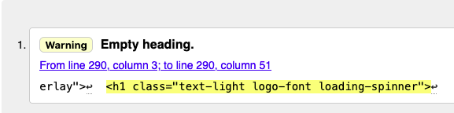
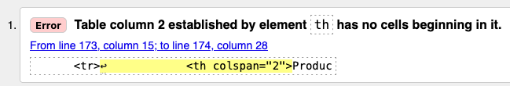
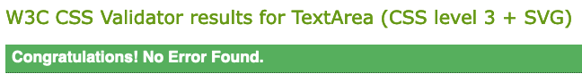
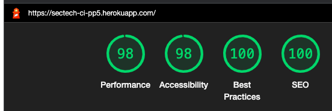

# Testing - SecTech CI Project 5

### [ Return to the project [README document](../README.md#testing) ]

## - Table of Contents -
* [Manual Testing](#manual-testing)
* [Automated Testing](#automated-testing)
* [Code Validation](#code-validation)


## Manual Testing

### UX Goals, User Stories

- #### As a Site Admin..
    - I want to to be able to setup and manage the product list
        - I tested that I could log into the admin panel and have ability to create, read, update or delete (CRUD) a product.  I tested that I could also do this via the main menu login. Note: All models are fully editable from the admin panel, and products specifically from the site home menu.

- #### As a first time user...  
    -  I want to be able to intuitively navigate the site
        - All menu options were tested to ensure that they opened the correct functionality.  The navigation bar remains at the top of the screen so that the user can easily move between options. The current page selection remains highlighted.

    -  I want to be able to see clear messages about my actions
        - I tested that system messages are displayed during all customer processes (login, checkout etc.)  Messages are coloured according to severity (alerts - yellow, warnings - red, etc.) and are clrealy seen on the top centre of screen.

    - I want to easily find information about the company and its products
        - I tested that I could click through the product cards on the main screen to allow purchasing the product. I tested that the About page displays the company information.

    -  I want to be able to Register as a customer of the site
       - I tested that I could create a new registered user from the login screen.

    -  I want to be able receive a registrtion confirmation email
       - I tested that I could verify a user account via a registration email by clicking on the secure link in the email.
    
    -  I want to be able to sign up for a newsletter
        - I tested that the Mailchimp embedded mailing list manager works by successfully capturing the user's email address
    
- #### As a returning visitor...
    - I want to be able to log into my registered account
        - I tested that I can log in as a user and view my account

      - I want to be able to easily see details of active software licences
        - I tested that when logged in as a user I can see my active software liences on my account page

      - I want to be able to easily see details of the previous purchases
        - I tested that when logged in as a user I can see my previous purchases on my account page

      - I want to be able to quickly purchase additional support or consultancy hours
        - I tested that when logged in as a user I can purchase additional products

    - I want to be able to reset my password
        - I tested that I could click on Forgot my password' and that I received I password reset link.  I was subsequently abe to login with the new password.

### Further Testing

- #### As a Site Admin
    - I want to ensure that site visitors who are unauthenticated cannot access any admin functionality other then viewing site content
        - I tested that unauthenticated visitors get redirected to the sign in page if attempting to access `/customers/account/new`, for example
    - I want to ensure site visitors can't access customer pages or functionality
        - I tested to options to add/edit/delete etc. were not visible to users when not logged in
        - I tested that attempting to access `/products/new/` redirects to a '403 - Forbidden' error message and allows the user to link back to the main page.
    - I want to ensure that site user can not access accounts created by other customers
        - I tested that attempting to access (for example) `/customers/account/3/`, which was owned by a differnt customer, displays an error message and redirects the user back to the home page.
    - I want the site to be fully responsive on different screen sizes
        - I tested that content resized properly and that the information was clearly readable and accesible on all screen sizes.
<hr>

## Automated Testing
Automated testing was not used for this project.

<hr>

## Code Validation

The [W3C Markup Validator](https://validator.w3.org/#validate_by_uri), [W3C CSS Jigsaw Validator](https://jigsaw.w3.org/css-validator/#validate_by_input) and the [JSHint JavaScript Code Quality Tool](https://jshint.com) were used to validate every page of the project for syntax errors. **NOTE: All validation was re-run after fixing any errors shown below to ensure that no further errors or warnings existed.**

### HTML
- **`Main home page: home.html`**
    - Document checking completed. No errors or warnings to show.
- **`Services page: products/products/product_list.html`**
    - Document checking completed. No errors or warnings to show.
- **`Product detail page: products/product_detail.html`**
    - Document checking completed. No errors or warnings to show.
- **`Manage Account page: customers/customer_detail.html`**
    - Document checking completed. No errors or warnings to show.
- **`Shopping cart page: shopping_cart/cart.html`**
    - Stray end span tag, line 65. Fixed.
    - Fixed - Document checking completed. No errors or warnings to show.
- **`Checkout page: checkout/checkout.html`**
    - No errors, one warning: Empty heading (shown below) Code is taken from CI Boutique Ado. Replaced with h1 a div. Fixed.
    <h2 align="center"></h2>
- **`Checkout page: checkout/checkout_success.html`**
    - Three warnings: A table row was 5 columns wide, which is less than the column count established by the first row (9). This is intended - make column display uncluttered as the last three items are totals only.
    - One error: Table column 2 established by element `th` has no cells beginning in it (shown below).
    I can not see anythihng wrong in the layout and have not been able to find a fix for this yet.  I have logged it to bugs section of readme.
    <h2 align="center"></h2>


### CSS
- **`base.css`**
<h2 align="center"></h2>

### JavaScript
- **`base: base.js`**
    - no issues ot fix
- **`checkout: stripe_elements.js`**
    - one warning: missing semicolon, line 115 - Fixed.

### Google Lighthouse
<h2 align="center"></h2>


<!-- <h2 align="center"></h2> -->

### Python PEP8
The [Flake8](https://pypi.org/project/flake8/) linter was used to ensure the code adhered to the Python Style Guidelines. Additionally, [autopep8](https://pypi.org/project/autopep8/) was used to correct code layout in some files to break long lines in a compliant way.  Exceptions were made in a couple of notable places: code that was generated by the Django setup or a third party library was not altered. In these instances the linter directive `# noqa` was added to the end of the line so that Flake8 would not flag it as an issue. Apart from system generated lines `settings.py`, there were lines in `checkout/webhooks.py` and `checkout/views.py` which could not be broken without significantly diminishing their readability.

Example usage in the terminal (taking just `home` app in this example):
```
(.venv) ~/dev/code-institute/sectech-pp5%[docs] flake8 --exclude .venv,migrations,tests.py |grep home
./home/models.py:1:1: F401 'django.db.models' imported but unused
./home/admin.py:1:1: F401 'django.contrib.admin' imported but unused
./home/urls.py:16:1: F401 'django.contrib.admin' imported but unused
./home/views.py:9:45: W291 trailing whitespace
./home/views.py:13:80: E501 line too long (92 > 79 characters)
./home/views.py:19:1: W293 blank line contains whitespace
(.venv) ~/dev/code-institute/sectech-pp5%[docs] autopep8 --in-place --aggressive --aggressive home/views.py
```
Just to confirm compliance, here's the result of checking the above `home/views.py` file with [PEP8 Online](http://pep8online.com/checkresult):

<h2 align="center"></h2>


<hr>

### [ [Click here to return to the project README document](../README.md#testing) ]
